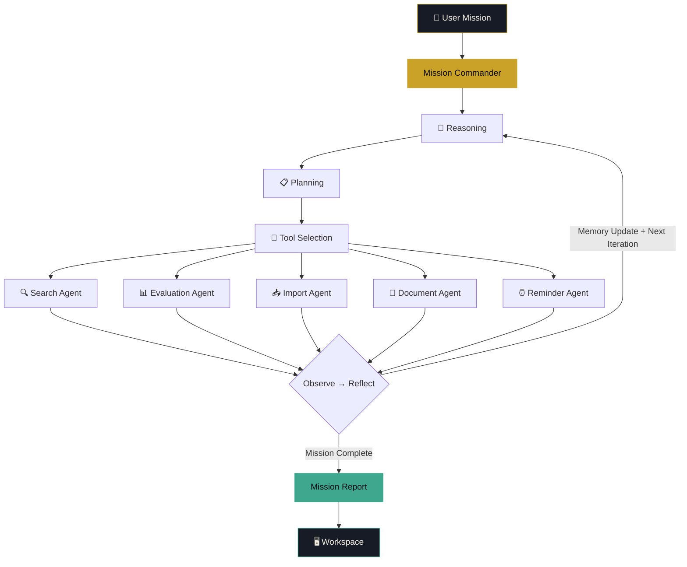
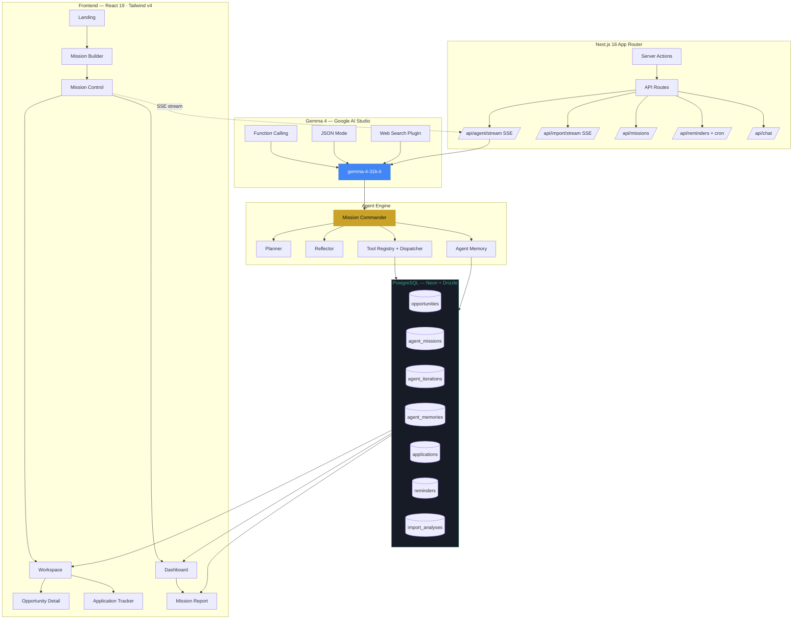

<p align="center">
  
</p>

<h1 align="center">Opportunity AI</h1>

<p align="center">
  <strong>Autonomous AI Career Intelligence Platform — powered by Gemma 4</strong>
</p>

<p align="center">
  <em>Give it a mission. Watch it work. Get a result.</em>
</p>

<p align="center">
  <a href="https://img.shields.io/badge/Gemma%204-4285F4?style=for-the-badge&logo=google&logoColor=white"></a>
  <a href="https://img.shields.io/badge/Next.js-000000?style=for-the-badge&logo=nextdotjs&logoColor=white"></a>
  <a href="https://img.shields.io/badge/TypeScript-3178C6?style=for-the-badge&logo=typescript&logoColor=white"></a>
  <a href="https://img.shields.io/badge/PostgreSQL-4169E1?style=for-the-badge&logo=postgresql&logoColor=white"></a>
  <a href="https://img.shields.io/badge/Drizzle%20ORM-C5F74F?style=for-the-badge&logo=drizzle&logoColor=black"></a>
  <a href="https://img.shields.io/badge/TailwindCSS-06B6D4?style=for-the-badge&logo=tailwindcss&logoColor=white"></a>
  <a href="https://img.shields.io/badge/License-MIT-yellow?style=for-the-badge"></a>
  <a href="https://img.shields.io/badge/AI%20Agent-8B5CF6?style=for-the-badge"></a>
  <a href="https://img.shields.io/badge/Hackathon-2026-FF6B35?style=for-the-badge"></a>
</p>

<p align="center">
  Built for <strong>Build with Gemma: AI for Africa Hackathon 2026</strong>
  <br />
  <strong>🏆 Target Award: Best Autonomous AI Agent</strong>
</p>

<p align="center"><em>Mission Control — Opportunity AI autonomously reasons, plans, executes tools and delivers complete opportunity workflows.</em></p>

---

## Project Overview

Opportunity AI is **not a chatbot** and **not a search engine**. It is an autonomous AI employee: you hand it a single mission — *"Find AI scholarships I qualify for, prepare my documents, and track the deadlines"* — and Gemma 4 plans, reasons, searches the web, evaluates eligibility, ranks opportunities, writes application documents, sets reminders, and delivers a complete mission report.

> 🎯 **No human intervention between input and output.** Every step streams live to the screen over SSE, so the agent's autonomy is not claimed — it is *watched*.

For **African students and early-career professionals**, this replaces an error-prone, weeks-long manual workflow with a single autonomous agent that does discovery, eligibility analysis, document generation, and deadline tracking on the user's behalf.

---

## The Problem

African students and early-career professionals lose real opportunities every cycle:

| Pain Point | Impact |
|---|---|
| **Fragmented sources** | Scholarships, internships, fellowships, and grants are scattered across hundreds of portals, PDFs, and mailing lists. |
| **Missed deadlines** | No centralized, deadline-aware tracking exists for most applicants. |
| **Generic applications** | Most candidates cannot afford personalized CVs, cover letters, and statements tuned to each opportunity. |
| **No eligibility clarity** | Students spend weeks applying to programs they do not qualify for — and never apply to ones they do. |

---

## Features

| Feature | Description |
|---|---|
| 🧭 **Mission Planning** | Define a goal and profile once; the agent decomposes it into an executable plan. |
| 🧠 **Reasoning** | Gemma 4 reasons over every result before deciding the next autonomous action. |
| 👥 **Multi-Agent System** | Six specialized sub-agents collaborate under a Mission Commander. |
| 🌐 **Web Search** | Live web search via Gemma's `web_search` plugin, with DuckDuckGo API as fallback. |
| 📥 **Import Opportunity** | Paste any URL or listing and receive a complete intelligence package in one pass. |
| ✅ **Eligibility Analysis** | Evidence-based fit scoring against the opportunity's real eligibility criteria. |
| 🏆 **Opportunity Ranking** | Match scores with per-factor breakdowns (education, skills, experience, funding). |
| 🗂️ **Application Tracker** | Kanban board: saved → drafting → submitted → interview → offer. |
| 📄 **Mission Reports** | One-click printable/PDF report of the entire mission lifecycle. |
| 📝 **CV Builder** | Personalized resume generated by Gemma for each target opportunity. |
| ✉️ **Cover Letter Generator** | Tailored cover letters tuned to the opportunity and the user's story. |
| 🎓 **Personal Statement Generator** | Admissions-grade personal statements from the user's profile. |
| ⏰ **Reminder Emails** | Real email delivery via hourly cron + Resend — reminders actually fire. |
| 🖥️ **Workspace** | Opportunity grid with per-item AI advice and verification badges. |
| 💾 **Persistent Memory** | Episodic / semantic / procedural memory recalled across missions. |
| 🕘 **Mission History** | Every mission archived and replayable, scoped to the user's device. |

---

<p align="center">
  
</p>

<p align="center"><em>Workspace, Dashboard and Opportunity Intelligence.</em></p>

---

## Autonomous Workflow



---

## Why It's Autonomous

| Judge's question | What the system does |
|---|---|
| Who drives the loop? | **Gemma 4** drives every phase: mission decomposition, reasoning, tool selection, reflection, and memory updates. No scripted paths, no canned answers. |
| What can it actually do alone? | 9 tools, 4 sourcing tiers, 6 autonomous iterations, 3-minute mission cap, full mission report generated end-to-end. |
| What if tools fail? | Every tool has a fallback chain (Gemma web search → DuckDuckGo → database → curated catalog) and a timeout; the loop degrades gracefully instead of crashing. |
| How do we know it isn't faking? | Full transparency: reasoning, tool calls, inputs/outputs, and confidence stream live; search results carry `urlVerified` and `deadlineSource` markers; fit scores are grounded in evidence. |
| Does it learn across missions? | Yes — episodic/semantic/procedural memory persisted per user, and recalled at the start of every new mission. |

### The Agent Loop

```
User Mission ──► Perceive ──► Reason ──► Plan ──► Tool Select
     ──► Execute ──► Observe ──► Reflect ──► Memory Update ──► (repeat)
     ──► Mission Complete ──► Dashboard ──► Workspace ──► Tracker ──► Report (PDF)
```

Orchestrated by a **Mission Commander** with specialized sub-agents: Search, Eligibility Evaluation, Ranking, Documents, Reflection, and Memory. Every iteration is persisted to `agent_iterations` — the full audit trail is replayable.

### The Toolset (Gemma function calling)

| Tool | What it does |
|---|---|
| `search_opportunities` | 4-tier sourcing: Gemma 4 web search → DuckDuckGo API → PostgreSQL catalog → curated fallback |
| `web_search` | Live web search with AI-analyzed results |
| `analyze_eligibility` | Gemma 4 scores candidate fit against real eligibility criteria |
| `rank_opportunities` | Match scoring and sorting |
| `generate_document` | Cover letters, resumes, personal statements, checklists |
| `gap_analysis` | Skill gaps + learning roadmap |
| `email_reminder` / `set_reminder` | Deadline tracking with real email delivery |
| `memory_recall` / `memory_store` | Episodic, semantic, procedural memory |

### Analyze Any Opportunity (URL → full analysis in one pass)

Beyond search, the **Import Agent** consumes a single URL or pasted listing and autonomously produces a complete intelligence package:

```
URL ──► scrape ──► structured extraction ──► eligibility scoring (evidence-based)
    ──► skill-gap roadmap ──► week-by-week application strategy
    ──► similar opportunities research ──► persisted to workspace + tracker + memory
```

Each import is verified: the application URL is probed live, the deadline is validated (never fabricated), and the fit score is grounded in the eligibility checklist when one exists.

---

## Architecture



**Stack:** Next.js 16 App Router · React 19 · TypeScript (strict) · Tailwind CSS v4 · shadcn/ui · Drizzle ORM · PostgreSQL (Neon) · Server-Sent Events · Framer Motion · Resend.

---

## Autonomous Capabilities

| Metric | Value |
|---|---|
| 📄 Pages | 17+ |
| 🔌 API Endpoints | 20+ |
| 🛠️ AI Tools | 30+ |
| ⚙️ Autonomous Capabilities | 9 |
| 👥 Specialized Agents | 6 |
| ✅ Reliability Tests | 12 |
| 🔎 Search Tiers | 4 |
| 🧠 Memory Types | 3 |
| ⏱️ Mission Engine | 230-second budget |
| 💻 TypeScript Coverage | 100% |

---

## Gemma 4 Integration (native, not bolted on)

- **`gemma-4-31b-it` is the entire decision-making engine** — reasoning, tool choices, eligibility judgments, documents, and advice are all generated by Gemma, served via **Google AI Studio** (free, no credit card) with OpenRouter as an optional fallback.
- **Native function calling** — the Google AI API `functionCall`/`functionResponse` protocol drives tool selection and execution (`lib/ai/gemma-provider.ts`).
- **JSON mode** (`response_mime_type: "application/json"`) guarantees parseable structured output for rankings, scores, and plans.
- **Web search capability** — Gemma's `web_search` plugin surfaces live, current opportunities; DuckDuckGo API is the resilience fallback.
- **Per-capability token budgets** — search, planning, and document generation each get tuned budgets (up to 8k for long-form docs), and all calls are **abortable** so the agent's 3-minute cap is never violated by a stalled model.
- **Runtime personalization** — every discovered opportunity receives Gemma-generated advice tuned to the user's profile, mission, and country.

---

## Reliability & Anti-Hallucination

The agent **never fabricates opportunity data** — anything it reports is either retrieved from a live source or explicitly marked as unverified. This is enforced in code and proven by tests.

| Guarantee | Implementation |
|---|---|
| No invented deadlines | `sanitizeDeadline()` rejects ambiguous/past/bare-year dates; results carry `deadline: null` + `deadlineSource: "stated" \| "unknown"` instead of fake dates |
| URLs are checked live | `verifyUrl()` HEAD/GET probe with timeout; results report `urlVerified` + HTTP status; UI shows "url verified / unverified" badges |
| Fit scores are evidence-based | `groundFitScore()` blends eligibility-checklist met-ratio + skill overlap into the AI score; with no evidence the score is **capped at 55/100** and flagged "limited evidence" |
| Reminders actually fire | Rows store the recipient email; a Vercel cron (`/api/reminders/run`, hourly, `CRON_SECRET`-protected) sends due reminders via Resend and marks them sent |
| Memory is actually recalled | `recallAcrossSessions()` pulls high-importance memories from the user's prior missions and injects them into the planner each iteration |
| Timeouts degrade gracefully | 3-min mission cap and 230s import cap finalize with partial results instead of hard failures; tool timeouts abort the underlying request |
| Proven by tests | **12 passing unit tests** (`npm test`) — deadline sanitization, URL validation, grounded scoring, type normalization, timeout/abort semantics |

```
Reminder pipeline:  Agent sets reminder (email stored on row)
   → Vercel Cron (hourly) → /api/reminders/run (CRON_SECRET)
   → due + unsent reminders → branded Resend email → marked sent (retried on failure)
```

---

## Database Schema

PostgreSQL via Neon, managed with Drizzle ORM (`lib/db/schema.ts`):

| Table | Purpose |
|---|---|
| `opportunities` | Sourced opportunities (type, eligibility, deadline, location, skills) |
| `user_sessions` | Per-user session, profile, analysis results |
| `agent_missions` | Mission goal, status, preferences, metadata |
| `agent_iterations` | Every loop phase (reasoning, tool used, params, results) |
| `agent_memories` | Episodic / semantic / procedural memories with importance scores |
| `applications` | Application tracker (saved → drafting → submitted → interview → offer) |
| `reminders` | Deadline / follow-up / document reminders (with delivery state) |
| `import_analyses` | Full import-agent audit trail (extraction, evaluation, strategy) |
| `notification_log` | Email send history |

---

## API Architecture

| Endpoint | Method | Purpose |
|---|---|---|
| `/api/agent/[sessionId]` | GET/POST | Mission state + launch |
| `/api/agent/[sessionId]/stream` | GET (SSE) | Live agent loop stream |
| `/api/import/[sessionId]/stream` | GET (SSE) | Live import agent stream |
| `/api/import/[sessionId]` | GET | Reload a completed import analysis |
| `/api/chat` | POST | AI assistant (web search capable) |
| `/api/missions` | GET | Device-scoped mission history |
| `/api/reminders` | GET/POST/DELETE | Reminders + Resend email |
| `/api/reminders/run` | GET (cron) | Hourly due-reminder delivery |

All streaming uses **Server-Sent Events** with heartbeat keep-alive and graceful shutdown. Client state syncs via `useSSE` hook.

---

## Environment Variables

| Variable | Required | Description |
|---|---|---|
| `GOOGLE_AI_API_KEY` | ✅ | Google AI Studio key — https://aistudio.google.com/apikey |
| `AI_PROVIDER` | ✅ | `gemma` (default) or `openrouter` |
| `AI_MODEL` | ✅ | `gemma-4-31b-it` |
| `DATABASE_URL` | ✅ | PostgreSQL connection string (Neon) |
| `OPENROUTER_API_KEY` | ⬜ | Fallback provider (optional) |
| `RESEND_API_KEY` | ⬜ | Email reminders (Resend) |
| `RESEND_FROM` | ⬜ | Email sender address |
| `CRON_SECRET` | ⬜ | Cron-protected jobs |

---

## Project Structure

```
opportunity-ai/
├── app/                        # Next.js App Router
│   ├── page.tsx                # Landing (hero, features, example missions)
│   ├── mission/                # Mission builder (goal + profile)
│   ├── agent/[sessionId]/      # Mission Control — live agent execution (SSE)
│   ├── workspace/[sessionId]/  # Opportunity grid
│   ├── dashboard/[sessionId]/  # Mission dashboard with charts
│   ├── opportunity/[sessionId]/[slug]/  # AI-scored opportunity detail
│   ├── applications/[sessionId]/       # Application Kanban tracker
│   ├── report/[sessionId]/     # Printable / PDF mission report
│   ├── memory/[sessionId]/     # Agent memory viewer
│   ├── settings/[sessionId]/   # System status + reminder preferences
│   ├── history/                # All past missions
│   ├── import/                 # Import agent (intake + results)
│   └── api/                    # 20+ REST + SSE endpoints
├── components/                 # Shared UI (shadcn/ui + custom)
├── lib/
│   ├── agent/                  # Autonomous agent engine
│   │   ├── tools/              # Tool registry, search, eligibility, documents
│   │   ├── memory/             # AgentMemory — 3 memory types + recall
│   │   ├── planner.ts          # Reasoning + planning
│   │   └── multi-agent.ts      # Mission Commander orchestration
│   ├── ai/                     # Gemma 4 provider + OpenRouter fallback
│   ├── import/                 # Import analyzer pipeline
│   ├── db/                     # Drizzle schema + client
│   └── actions/                # Server actions (CRUD)
└── __tests__/                  # Reliability test suite (12 tests)
```

---

## Screenshots

### Mission Control

<p align="center">
  
</p>
<p align="center"><em>Mission Control — the agent streams reasoning, tool calls, and results in real time.</em></p>

### Workspace & Dashboard

<p align="center">
  
</p>
<p align="center"><em>Workspace, Dashboard and Opportunity Intelligence.</em></p>

### Coming Soon

| Screen | Status |
|---|---|
| Mission Builder | 🚧 Screenshot Coming Soon |
| Import Opportunity | 🚧 Screenshot Coming Soon |
| Dashboard | 🚧 Screenshot Coming Soon |
| Mission Report | 🚧 Screenshot Coming Soon |
| Application Tracker | 🚧 Screenshot Coming Soon |
| Workspace | 🚧 Screenshot Coming Soon |
| Chat | 🚧 Screenshot Coming Soon |
| Profile | 🚧 Screenshot Coming Soon |
| Settings | 🚧 Screenshot Coming Soon |

---

## Tech Stack

| Category | Technology |
|---|---|
| **Frontend** | Next.js 16 App Router · React 19 · TypeScript 5 (strict) · Tailwind CSS v4 · shadcn/ui (Radix) · Framer Motion · lucide-react |
| **Backend** | Next.js API Routes · Server Actions · Server-Sent Events |
| **AI** | Gemma 4 (`gemma-4-31b-it`) · Google AI Studio · OpenRouter fallback · function calling · JSON mode |
| **Database** | PostgreSQL (Neon) · Drizzle ORM |
| **Deployment** | Vercel · Cron jobs · Regions: `iad1` |
| **Notifications** | Resend (transactional email) · branded templates |
| **Animation** | Framer Motion · tw-animate-css |

---

## Demo (2-minute judge script)

| Time | Step |
|---|---|
| **0:00 – 0:10** | **Landing** — *"Give it a mission — watch it work — get a result."* Click an example mission: **"Find AI internships in Europe for Summer 2027"**. |
| **0:10 – 0:20** | **Mission Builder** — profile fills in (skills, education, country). Hit **Launch Mission**. |
| **0:20 – 1:20** | **Mission Control** — the money shot. The agent streams live: *Mission Commander decomposing the mission… Search Agent querying Gemma's web search… Evaluation Agent comparing eligibility… Document Agent drafting…* Tool calls appear with inputs, outputs, and durations — the judge is literally watching the agent think and act. |
| **1:20 – 1:40** | **Dashboard + Workspace** — mission stats, source distribution, discovered opportunities with verified URLs and real deadlines. |
| **1:40 – 2:00** | **Application Tracker + Report** — drag a saved opportunity into "Preparing", show the deadline reminder row, then open the printable mission report. |

**Screenshot checklist for the submission:** landing hero · Mission Control live timeline · dashboard charts · AI-scored opportunity detail · Kanban tracker · mission report · settings (system status + reminders) · `npm test` output.

---

## Quick Start

```bash
npm install
# copy .env.example → .env; fill GOOGLE_AI_API_KEY + DATABASE_URL
npm run seed      # optional: pre-populate opportunity catalog
npm run dev       # http://localhost:3000
npm test          # 12 reliability tests
npm run build
```

## Deployment (Vercel)

```bash
npm i -g vercel
vercel
```

Set environment variables in the Vercel dashboard (Project → Settings → Environment Variables), then **Redeploy**. `vercel.json` ships with the hourly reminder cron schedule.

---

## Roadmap

### ✅ Completed

- [x] Autonomous mission loop (perceive → reason → plan → execute → reflect → memory)
- [x] 9 Gemma-powered tools with 4-tier opportunity sourcing
- [x] Import Agent — URL/text → full analysis in one pass
- [x] Device-scoped mission history
- [x] Cross-session memory recall
- [x] Reminder delivery pipeline (cron + Resend)
- [x] Anti-hallucination layer (deadline/URL validation, grounded fit scores)
- [x] 12-test reliability suite

### 🚧 In Progress

- [ ] Semantic memory recall wired into the mission loop
- [ ] Deeper sub-agent autonomy (multi-step agent tasks)
- [ ] Multi-language missions (French, Portuguese, Swahili, Arabic)
- [ ] CV builder with templates + versioning

### 🔮 Future

- [ ] WhatsApp / Telegram notification channel
- [ ] Community opportunity sharing + verification badges
- [ ] User accounts & auth (email OTP)

---

## Contributing

Contributions are welcome — issues, feature requests, docs, and PRs all help.

1. **Fork** the repository.
2. **Branch** — `git checkout -b feat/amazing`
3. **Commit** — `git commit -m "Add amazing feature"`
4. **Push** — `git push origin feat/amazing`
5. **Open a Pull Request.**

Please ensure `npm run build` and `npm test` pass before submitting. When changing agent behavior, add a test to `__tests__/` — reliability is this project's contract.

---

## License

MIT © 2026 Opportunity AI — built with [Gemma 4](https://ai.google.dev/gemma) for the AI for Africa Hackathon 2026.

<p align="center"><strong>⚡ Give it a mission. Watch it work. Get a result.</strong></p>
